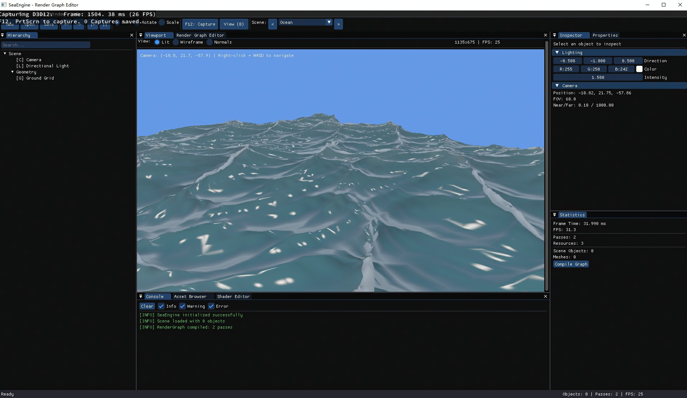

# SeaEngine

<p align="center">
  
  
  
  
</p>

一个轻量级的游戏渲染引擎，类似 NVIDIA Falcor，专注于渲染效果预研和可视化管线编辑。

## 📸 编辑器截图

<p align="center">
  
</p>

## ✨ 主要特性

### 🎨 图形化渲染管线编辑器
- 基于 ImNodes 的可视化节点编辑器
- 拖拽式连线搭建渲染管线
- 实时预览渲染结果
- 支持保存/加载管线配置

### 📊 RenderGraph 系统
- 自动拓扑排序确定 Pass 执行顺序
- 智能资源依赖分析
- 自动插入资源屏障 (Resource Barriers)
- 临时资源生命周期管理
- 资源池化复用

### 🖥️ 专业编辑器界面
- 可停靠的面板系统 (Docking)
- Viewport 3D 场景视图
- Hierarchy 场景层级面板
- Inspector 属性检查器
- Console 控制台日志
- Asset Browser 资源浏览器

### ⚡ Shader 系统
- 支持 HLSL Shader Model 5.0 - 6.6
- 使用 DXC (DirectX Shader Compiler)
- 热重载：自动检测 shader 文件变化并重新编译
- Shader 反射：自动解析常量缓冲区和资源绑定

### 🔧 调试工具
- RenderDoc 集成：按 F12 触发截帧
- D3D12 调试层支持
- 详细的日志系统

## 🏗️ 技术架构

### 项目结构

```
SeaEngine/
├── Source/
│   ├── Core/           # 核心系统
│   │   ├── Application     # 应用程序框架
│   │   ├── Window          # Win32 窗口管理
│   │   ├── Input           # 输入处理
│   │   ├── Log             # 日志系统 (spdlog)
│   │   ├── Timer           # 高精度计时器
│   │   └── FileSystem      # 文件系统
│   │
│   ├── Graphics/       # DX12 图形抽象层
│   │   ├── Device          # D3D12 设备
│   │   ├── SwapChain       # 交换链
│   │   ├── CommandQueue    # 命令队列
│   │   ├── CommandList     # 命令列表
│   │   ├── Buffer          # 顶点/索引/常量缓冲区
│   │   ├── Texture         # 2D/3D 纹理
│   │   ├── PipelineState   # PSO 管理
│   │   ├── RootSignature   # 根签名
│   │   ├── DescriptorHeap  # 描述符堆
│   │   └── RenderDocCapture# RenderDoc 集成
│   │
│   ├── RenderGraph/    # 渲染图系统
│   │   ├── RenderGraph     # 渲染图核心
│   │   ├── PassNode        # Pass 节点
│   │   ├── ResourceNode    # 资源节点
│   │   ├── GraphCompiler   # 图编译器
│   │   ├── ResourcePool    # 资源池
│   │   └── FrameResource   # 帧资源管理
│   │
│   ├── Shader/         # Shader 系统
│   │   ├── ShaderCompiler  # DXC 编译器封装
│   │   ├── ShaderLibrary   # Shader 库管理
│   │   ├── ShaderReflection# Shader 反射
│   │   └── HotReload       # 热重载监控
│   │
│   ├── Scene/          # 场景系统
│   │   ├── Camera          # 相机 (透视/正交)
│   │   ├── Mesh            # 网格 (支持 OBJ)
│   │   └── SimpleRenderer  # 基础渲染器
│   │
│   └── Editor/         # 编辑器
│       ├── ImGuiRenderer   # ImGui 集成
│       ├── NodeEditor      # 节点编辑器
│       ├── PropertyPanel   # 属性面板
│       ├── ShaderEditor    # Shader 编辑器
│       └── GraphSerializer # 图序列化
│
├── Shaders/            # HLSL 着色器
│   ├── Common.hlsli        # 公共头文件
│   ├── Basic.hlsl          # 基础着色器
│   ├── Grid.hlsl           # 网格着色器
│   ├── GBuffer_VS/PS.hlsl  # G-Buffer 着色器
│   ├── DeferredLighting_PS.hlsl  # 延迟光照
│   ├── Blur_CS.hlsl        # 模糊计算着色器
│   └── Tonemap_PS.hlsl     # 色调映射
│
├── Samples/            # 示例应用
│   └── SampleApp           # 完整编辑器示例
│
└── build/              # 构建输出
```

### 依赖库

| 库 | 版本 | 用途 |
|---|---|---|
| DirectX 12 | - | 图形 API |
| DirectX-Headers | v1.613.1 | D3D12 头文件 |
| DirectXMath | dec2023 | 数学库 |
| ImGui | v1.91.6-docking | GUI 界面 |
| ImNodes | master | 节点编辑器 |
| spdlog | v1.13.0 | 日志系统 |
| nlohmann/json | v3.11.3 | JSON 解析 |
| tinyobjloader | v2.0.0rc13 | OBJ 模型加载 |
| stb | master | 图像加载 |

## 🚀 快速开始

### 系统要求

- **操作系统**: Windows 10/11
- **编译器**: Visual Studio 2022 或更高版本
- **构建工具**: CMake 3.20+
- **SDK**: Windows SDK 10.0.19041.0 或更高

### 构建步骤

```powershell
# 1. 克隆仓库
git clone https://github.com/yourusername/SeaEngine.git
cd SeaEngine

# 2. 创建构建目录
mkdir build
cd build

# 3. 生成项目 (CMake 会自动下载依赖)
cmake .. -G "Visual Studio 17 2022" -A x64

# 4. 编译
cmake --build . --config Release

# 或者用 Visual Studio 打开
start SeaEngine.sln
```

### 运行

```powershell
# 运行示例应用
.\bin\Release\SampleApp.exe
```

## 📖 使用指南

### 节点编辑器

1. **添加节点**: 右键菜单 → 选择 Pass 或 Resource 类型
2. **连接节点**: 从输出端口拖拽到输入端口
3. **删除节点**: 选中节点后按 Delete
4. **编译管线**: 点击 "Compile Graph" 按钮

### Pass 类型

| 类型 | 描述 |
|---|---|
| Graphics Pass | 光栅化渲染，用于绘制几何体 |
| Compute Pass | 计算着色器，用于 GPU 计算 |
| Copy Pass | 资源拷贝操作 |

### 创建自定义渲染 Pass

```cpp
// 1. 创建 Pass
u32 passId = m_RenderGraph->AddPass("MyPass", PassType::Graphics);

// 2. 设置执行回调
m_RenderGraph->SetPassExecuteCallback(passId, 
    [this](CommandList& cmdList, RenderGraphContext& ctx) {
        // 获取输入/输出资源
        auto inputSRV = ctx.GetInputSRV(0);
        auto outputRTV = ctx.GetOutputRTV(0);
        
        // 执行渲染
        cmdList.SetPipelineState(m_PSO.get());
        cmdList.SetRenderTargets({ outputRTV }, {});
        cmdList.Draw(3, 1);
    });

// 3. 编译并执行
m_RenderGraph->Compile();
m_RenderGraph->Execute(cmdList);
```

### Shader 开发

在 `Shaders/` 目录下创建 HLSL 文件:

```hlsl
// MyShader.hlsl
#include "Common.hlsli"

cbuffer FrameConstants : register(b0)
{
    float4x4 ViewProjection;
    float3 CameraPosition;
    float Time;
};

struct VSInput
{
    float3 Position : POSITION;
    float3 Normal : NORMAL;
    float2 TexCoord : TEXCOORD;
};

struct PSInput
{
    float4 Position : SV_POSITION;
    float3 Normal : NORMAL;
    float2 TexCoord : TEXCOORD;
};

PSInput VSMain(VSInput input)
{
    PSInput output;
    output.Position = mul(float4(input.Position, 1.0), ViewProjection);
    output.Normal = input.Normal;
    output.TexCoord = input.TexCoord;
    return output;
}

float4 PSMain(PSInput input) : SV_TARGET
{
    float3 lightDir = normalize(float3(-0.5, -1.0, 0.5));
    float NdotL = saturate(dot(input.Normal, -lightDir));
    float3 color = float3(1, 1, 1) * (NdotL * 0.8 + 0.2);
    return float4(color, 1.0);
}
```

### 相机控制

| 操作 | 功能 |
|---|---|
| 鼠标右键 + 拖拽 | 旋转视角 |
| W/A/S/D | 前后左右移动 |
| Q/E | 上下移动 |
| Shift | 加速移动 |

## ⌨️ 快捷键

| 快捷键 | 功能 |
|---|---|
| F12 | RenderDoc 截帧 |
| Ctrl+S | 保存 |
| Ctrl+Z | 撤销 |
| Ctrl+Y | 重做 |
| Delete | 删除选中项 |
| ESC | 退出应用 |

## ⚙️ 配置选项

### CMake 选项

```cmake
# 启用 RenderDoc 集成 (默认 ON)
cmake .. -DSEA_ENABLE_RENDERDOC=ON

# 构建示例应用 (默认 ON)
cmake .. -DSEA_BUILD_SAMPLES=ON
```

### 应用配置

```cpp
ApplicationConfig config;
config.window.title = "My Renderer";
config.window.width = 1920;
config.window.height = 1080;
config.enableValidation = true;   // D3D12 调试层
config.enableRenderDoc = true;    // RenderDoc 集成
```

## 🔍 调试

### RenderDoc 截帧

1. 安装 [RenderDoc](https://renderdoc.org/)
2. 运行应用程序
3. 按 **F12** 触发截帧
4. 在 RenderDoc 中分析帧数据

### D3D12 调试层

启用 `enableValidation = true` 后，D3D12 调试层会:
- 验证 API 调用正确性
- 检测资源泄漏
- 输出详细调试信息

## 📁 资源格式

| 格式 | 支持情况 |
|---|---|
| OBJ | ✅ 完整支持 |
| PNG/JPG/BMP | ✅ 通过 stb_image |
| HLSL | ✅ SM 5.0 - 6.6 |
| JSON | ✅ 图配置文件 |

## 🛣️ 路线图

- [ ] PBR 材质系统
- [ ] 阴影映射
- [ ] 后处理效果栈
- [ ] 场景序列化
- [ ] 资产导入管线
- [ ] Vulkan 后端

## 📄 许可证

本项目采用 MIT 许可证 - 详见 [LICENSE](LICENSE) 文件

## 🙏 致谢

- [NVIDIA Falcor](https://github.com/NVIDIAGameWorks/Falcor) - 架构灵感
- [LearnOpenGL](https://learnopengl.com/) - 渲染技术参考
- [DirectX-Graphics-Samples](https://github.com/microsoft/DirectX-Graphics-Samples) - DX12 示例

---

<p align="center">
  Made with ❤️ for Graphics Programmers
</p>
